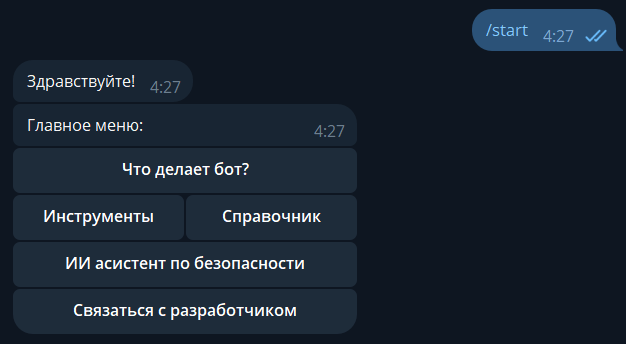

# 🛡️ Personal InfoSec Bot

Telegram-бот персональной информационной безопасности для обычного пользователя.  
Объединяет **ИИ-ассистента**, набор **практических инструментов** и **справочник по ИБ** в одном месте.

---

### 📋 Демо



---

### 🤖 ИИ-ассистент

Чат с LLM (Qwen3-32b через Groq API) — задавай вопросы по информационной безопасности, получай советы и объяснения в свободной форме.

---

### 🔍 Инструменты

| Инструмент | Описание |
|---|---|
| 🔗 Проверка URL | Анализ ссылки на фишинг и вредоносное ПО |
| 💧 Breach Scan | Проверка email по базам утечек через XposedOrNot |
| 🔒 SSL/TLS проверка | Валидность сертификата, дата истечения |
| 🔑 Генератор паролей | Сложные пароли заданной длины и набора символов |
| 💪 Анализатор паролей | Оценка стойкости пароля |
| 🛡️ Заголовки безопасности | Проверка наличия SSL, HSTS, CSP и других заголовков |

---

### 📚 Справочник по ИБ

Структурированная база знаний по основным угрозам и методам защиты:

- 🛡️ Как обезопасить себя в соцсетях
- 🤖 Как понять что Telegram-бот безопасен
- 🔑 Почему важно использовать разные пароли
- 🔒 Почему важна аутентификация (2FA)
- 🎣 Как распознать фишинг (сайты)

---

## 🛠️ Стек

- **Python 3.13+**
- **Redis 6+** - храним состояния бота
- **aiogram 3** - фреймворк для Telegram Bot API
- **aiogram-dialog** - надстройка над фреймворком aiogram
- **VirusTotal API** - проверяем ссылки с помощью лучшего сервиса для поиска угроз
- **XposedOrNot** - используем для проверки утечек почты
---

## 🚀 Запуск

### 1. Запусти Redis (WSL/Linux)

```bash
sudo service redis-server start
```

### 2. Клонируй репозиторий

```bash
git clone https://github.com/J3lackai/Personal_infosec_bot.git
cd Personal_infosec_bot
```

### 3. Установи зависимости

```bash
pip install -r requirements.txt
```

### 4. Настрой переменные окружения

Создай файл `.env` на основе `.env.example`:

- **BOT_TOKEN** — получи у [@BotFather](https://t.me/BotFather)
- **GROQ_API_KEY** — зарегистрируйся на [console.groq.com](https://console.groq.com)
- **VIRUSTOTAL_API_KEY** — регистрируйся на [virus total](https://www.virustotal.com/)

### 5. Запусти бота

```bash
python main.py
```
---

## 🔍 Тестирование

### Методика тестирования
Поскольку проект представляет собой Telegram-бота с интерфейсом на основе диалоговых окон,
 основным методом проверки выбрано функциональное тестирование вручную — последовательная
  проверка каждого пользовательского сценария через реальное взаимодействие с ботом.
   Тестирование разделено на семь блоков, охватывающих все ключевые аспекты функциональности.
   
[Результаты тестов](./tests/Результаты%20тестирования.pdf)

---

## 📄 Лицензия

MIT

---

## 👤 Автор

**J3lackai** — [GitHub](https://github.com/J3lackai)
